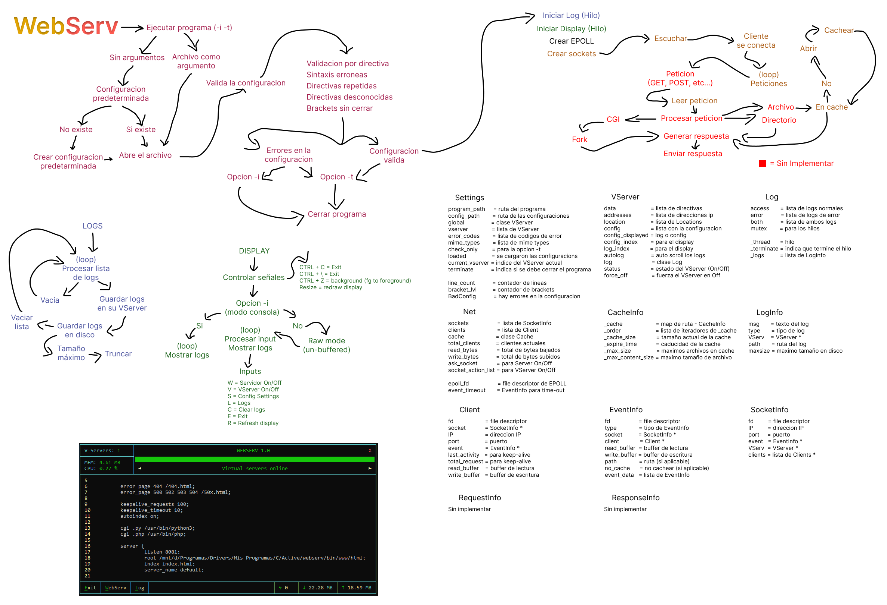

<div align="center">


*HTTP web server with CGI script execution support*

</div>

<div align="center">
  
</div>

# Webserv 1.0

[README en Español](README_es.md)

`Webserv` is a web server written in C++ with support for `HTTP 1.1`. It is designed to serve any web page that does not require SSL/TLS, as long as it is properly configured.

## ✨ Features
- `HTTP/1.1 support`: Webserv accepts and processes HTTP requests according to the standard protocol.
- `Customizable configuration`: Webserv can be started with specific configuration files.
- `CGI support`: Executes CGI scripts (e.g., PHP, Python, etc.).
- `Log handling`: Webserv generates both access and error logs.
- `Multiple IPs and ports`: Configure multiple virtual servers with different IPs and ports.
- `Directory listing`: Supports autoindex functionality.
- `Custom error pages`: Configurable error pages for different HTTP codes.
- `Redirections`: Supports HTTP redirections.
- `Request limits`: Configurable maximum body size.
- `Keep-alive connections`: Maintains persistent connections.

## 🔧 Installation

```bash
git clone https://github.com/tu-usuario/webserv.git
cd webserv
make
```

## 🛠️ Usage options
- `GUI mode`: `./webserv` opens Webserv in GUI mode by default.
- `Console mode`: `./webserv -i` starts Webserv in console mode.
- `Validation`: `./webserv -t` validates the configuration file.
- `Background mode`: `./webserv &` runs Webserv in the background.
- `Custom config file`: `./webserv path/to/config.cfg` uses a specific configuration file.

If no configuration file is specified, `default.cfg` in the `bin` directory is used. If it does not exist, it will be created automatically.

## ⚙️ Configuration file

The configuration file allows customizing server behavior. Settings may include:

- `Global directives`: Applied to all virtual servers.
- `Virtual server configuration`: Specifies IP, ports, and server name.
- `Location configurations`: Handles different paths on the server.
  
### Example configuration file:

```config
http {
    body_maxsize 10M;
    cgi .php    /usr/bin/php-cgi;
    cgi .py     cgi-bin/python-cgi;
    cgi .cgi    cgi-bin/test-cgi;
    
    server {
        listen 8081;
        listen 127.0.0.0/24:8085;
        server_name Default;
        
        root www/html/;
        index index.php index.html;
        
        location / {
            try_files $uri $uri/ =404;
        }
        
        location /directory/ {
            autoindex on;
        }
        
        error_page 403 /error_pages/403_Forbidden/index.html;
        
        access_log    logs/default_access.log;
        error_log    logs/default_error.log;
    }
}
```

### Main directives
| Directive      | Description                                        |
|----------------|----------------------------------------------------|
| `body_maxsize` | Maximum allowed request body size                  |
| `cgi`          | Configuration for CGI processors by file extension |
| `listen`       | Port or IP:Port to listen on                       |
| `server_name`  | Virtual server name                                |
| `root`         | Root directory for served files                    |
| `index`        | Default files served when a directory is requested |
| `location`     | Specific configuration for a given path            |
| `try_files`    | Attempts to serve files in a specific order        |
| `autoindex`    | Enables/disables directory listing                 |
| `error_page`   | Defines custom pages for HTTP error codes          |
| `access_log`   | Access log file location                           |
| `error_log`    | Error log file location                            |

## 📁 Project structure
The project follows a structured organization:

- `/bin`: Contains configuration files, CGI executables, and web content
  - `/default.cfg`: Default configuration
  - `/cgi-bin`: CGI executables
  - `/www`: Web content and resources
- `/doc`: Documentation files
- `/inc`: Header files organized by functionality
  - `/Display`: User interface
  - `/Log`: Logging system
  - `/Network`: Connection and socket management
  - `/Protocol`: HTTP protocol implementation
  - `/Settings`: Server configuration
  - `/Thread`: Thread management
  - `/Utils`: Common utilities
- `/src`: Source files corresponding to the header organization

## 💻 Technical implementation
- `Written in C++98`
- `Multi-threaded system`:
  - Main thread for connection management
  - Secondary thread for terminal UI
  - Dedicated thread for logging
- `Uses epoll` to handle multiple connections efficiently
- `Parsing and generation` of HTTP/1.1 requests and responses
- `Security measures` against malicious requests
- `File cache system` to improve performance

## 📄 License

This project is licensed under the WTFPL – [Do What the Fuck You Want to Public License](http://www.wtfpl.net/about/).

---

<div align="center">

**🌐 Developed as part of the 42 School curriculum 🌐**

*"Because real men write their own web servers"*

</div>


